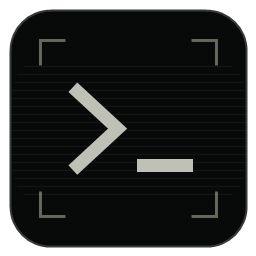
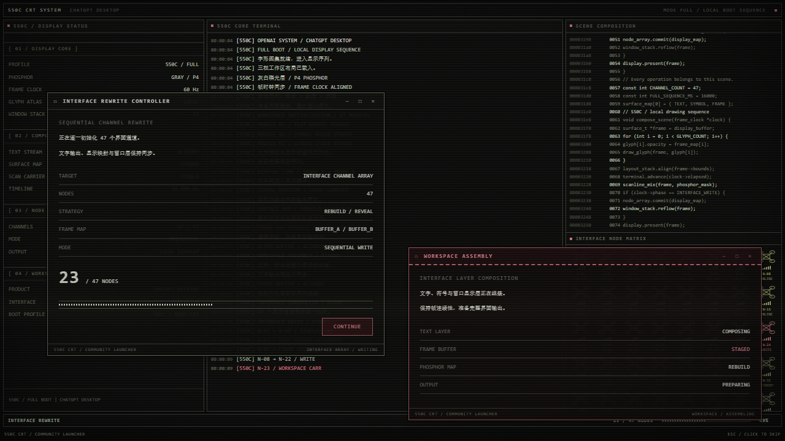

# 550C CRT Launcher

灰白 CRT 风格的独立 Windows 启动器与主题套件，适配官方 ChatGPT Desktop。





黑底磷光、细扫描线、打字终端、密集面板、可操作弹窗与约 16 秒 Full 启动序列。配套官方外观导入预设使用 Consolas 英文与新宋体中文回退。

这是社区项目，与 OpenAI 无关联或背书。装饰性启动文本不是 OpenAI 内部日志、真实安全状态或服务诊断。

## 快速开始

从维护者发布的 GitHub Releases 下载 `550c-crt-launcher-0.1.0-preview.1-win-x64.zip`，解压到可写目录，保留所有文件。

1. 双击 `550C-Boot-Preview.exe`，只播放动画，结束自动退出。此入口不检测或启动 ChatGPT。
2. 双击 `550C-CRT-Launcher.exe`，使用实际注册的官方 ChatGPT MSIX 入口启动。动画结束且主窗口出现后，约 450ms 淡出；客户端未出现时保持等待画面。
3. 官方 ChatGPT 设置 → 视觉风格 → 深色 → 主题导入，粘贴 `themes/550C_GRAY_CRT_v02.txt` 中的完整一行。导入前用官方“复制主题”保存自己的原主题。工具不会自动修改聊天外观。
4. 如需桌面入口，可对 Launcher.exe 使用 Windows 的“发送到 → 桌面快捷方式”；或明确运行附带的 `scripts/create-shortcut.ps1 -RuntimeDirectory <解压目录>`。该脚本只创建新名为 **550C CRT Launcher** 的快捷方式，遇到同名文件就停止，不替换官方入口。

已有 ChatGPT 窗口时，默认直接聚焦，不重播动画。`config.json` 的 `playWhenAlreadyRunning=true` 可启用短版；始终完整播放并交接可使用命令行 `--full-preview`。Esc / 点击非按钮区域跳过：已有目标则快速交接，尚未出现则进入最简等待。弹窗按钮和右上角控件只作用于动画弹窗。

## 系统要求

- Windows 10/11 x64，现阶段只支持官方 MSIX/Store 注册的 ChatGPT；Win32 安装、ARM64 和 macOS 不在此预览版范围内。
- 已有 .NET Framework 4.8 和 WebView2 Evergreen Runtime。不会自动安装、修改或更新这些组件；缺失时报告问题。WebView2 Runtime 下载与部署方式见 [Microsoft 文档](https://learn.microsoft.com/en-us/microsoft-edge/webview2/concepts/distribution)。
- 动画资源全本地，无服务器、端口、CDN、运行期下载。官方 ChatGPT 自身的网络行为不由本项目控制。
- WebView2 临时内存明显高于纯原生窗口；历史同架构 Full 测试进程树峰值约 800–850 MiB。它退出后不常驻，但目前不宣称满足轻量内存目标。

## 音乐与字体

公开包默认静音，未附带 Slow Motion 或任何下载音乐。拥有适当使用权的本地音频可放入 `assets/audio/local-bgm.wav`，然后设置 `config.json` 的 `audio.enabled=true`。播放器跟随动画时间、支持音量及淡出；不调系统音量。不提交个人音频到仓库。

主题只包含字体名称，不含字体文件。Consolas / 新宋体 / 宋体由系统提供；缺少某字体时使用后续回退，效果可能不同。主题的颜色、字体、透明偏好与动画面板是两种独立能力：导入主题不会给官方聊天界面添加扫描线或改变布局。详见 [主题与恢复](docs/THEME.md)。

## 从源码构建

使用现有 Windows x64 .NET Framework 编译器，不需要额外安装 .NET SDK、Electron 或大型工具链。在 Windows PowerShell 中进入仓库目录：

```powershell
# 仅首次显式执行时联网下载固定的 WebView2 SDK 接口包，不安装 Runtime。
.\scripts\restore-dependencies.ps1
.\scripts\build.ps1
.\scripts\package.ps1
```

包版本固定 `1.0.4258.31`，下载后校验 SHA256。也可预先供应同版本已校验的 `vendor/webview2-1.0.4258.31`，离线构建。输出为 `out/550c-crt-launcher-0.1.0-preview.1-win-x64`。已有版本输出不会覆盖，请使用新构建目录。若设备策略禁止脚本，遵循自己的设备策略或在已允许执行脚本的开发环境构建；工具不改变执行策略或安全设置。

```powershell
.\scripts\build.ps1 -TestBuild
.\scripts\test.ps1
```

测试桥接器只编入隔离测试 EXE，模拟注册、等待、失败及交接；不会启动官方客户端。实际注册只读探测可运行 `550C-CRT-Launcher.exe --audit-client`，不激活应用。验收范围见 [QA](docs/QA.md)。

## 架构与安全

原生无边框窗口 + 本地 HTML/CSS/JS + WebView2；公开 Windows 激活 API 请求注册入口，查询窗口并移交前台。每次根据 Shell 实际注册信息和对应包清单识别入口与进程名，启动不使用 WindowsApps 版本路径。当前支持经本机审计的 OpenAI 发布者标识；如官方以后更换注册名称/发布者，发现失败即停止，不回退猜测路径。

不修改官方文件、app.asar、签名、Store 包或更新机制；不注入、hook 或调试附加；不改 hosts、注册表、安全设置或启动项。原官方入口始终独立可用。运行日志与临时浏览器目录写在解压目录的 `evidence/`、`runtime/`，不会扫描凭据或登录资料。卸载只需移除自己创建的入口和解压目录；请先保存自己的修改。

## 发布状态与许可

`0.1.0-preview.1` 为发布候选，不是稳定版。此公共候选将灰白视觉与已有外部控制层组合；真实冷启动、不同设备/DPI、前台移交稳定性与新字体实际导入仍需用户验收。自动化测试不等于人的实播批准。

项目独立实现的代码、配置、文档与原创终端图标采用 MIT。Microsoft WebView2 接口保留自己的完整许可。未包含参考原稿、受限音乐、系统字体或改造的 OpenAI 图标。公开图标为灰白 `>_` 终端符号；私人使用的 GPT 结形图标未进入公开包。详见 [CREDITS](CREDITS.md)、[第三方说明](THIRD_PARTY_NOTICES.md) 与 [公开分发审计](docs/DISTRIBUTION.md)。

视觉参考 [dsh-550c-boot](https://github.com/yannicksong0106/dsh-550c-boot) 与用户提供的 [Full 视频](https://www.bilibili.com/video/BV1jDaz6WExP/)。本项目独立实现，不附带上游原动画代码。欢迎反馈，报告前请先检查日志并移除私人路径/窗口截图；参见 [贡献说明](CONTRIBUTING.md)。
